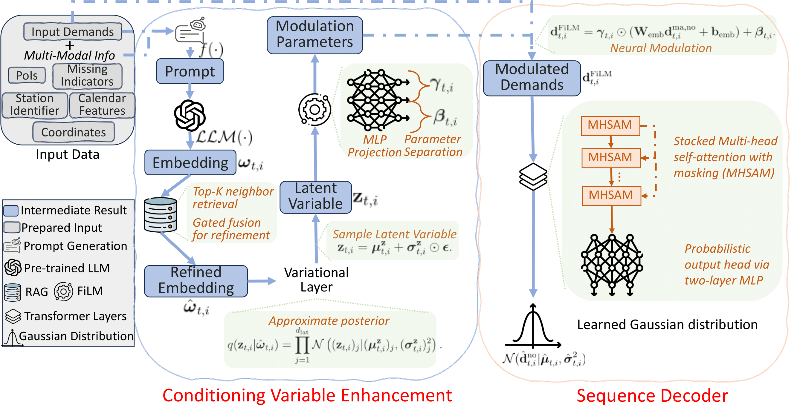
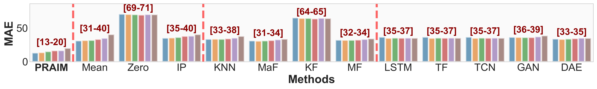
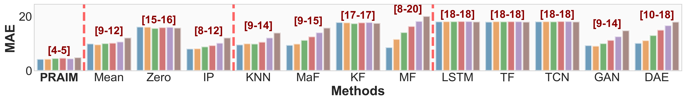
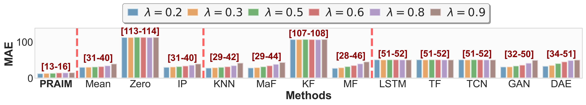
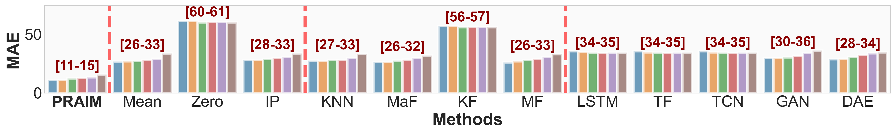
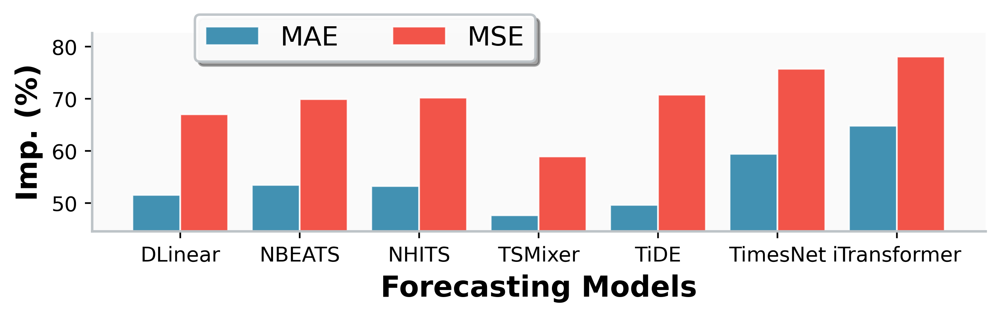
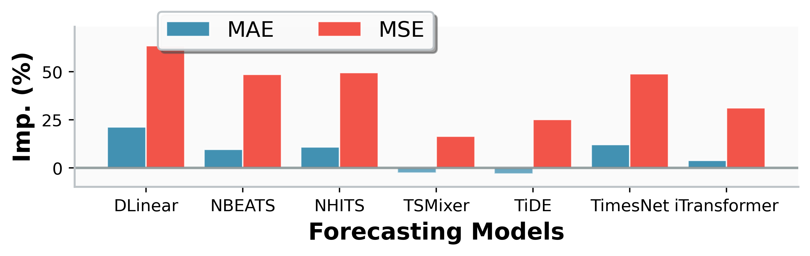
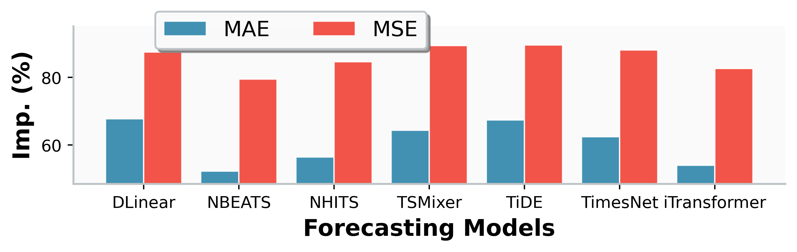
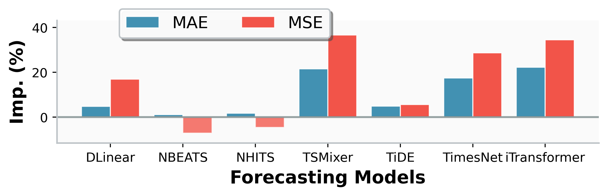

# PRAIM

This is the official repository for our paper published in IEEE Transactions on Smart Grid, entitled **A Unified Variational Imputation Framework for Electric Vehicle Charging Data Using Retrieval-Augmented Language Model**.

<!-- The ``outputs`` folder includes checkpoints to load the trained 

The ``data_xx`` folders include data -->


## Methodology Description



### Dataset Preparation

Our study uses four datasets from [Boulder (US)](https://open-data.bouldercolorado.gov/datasets/95992b3938be4622b07f0b05eba95d4c_0/explore), [Palo Alto (USA)](https://data.paloalto.gov/datasets/194693/electric-vehicle-charging-station-usage-july-2011-dec-2020/), [Dundee (UK)](https://data.dundeecity.gov.uk/search?q=charging), and [Perth (UK)](https://data.pkc.gov.uk/search?groupIds=03913ed5717b4e90babe7f88f89fe56a&q=charging), whose EV charging data is made publicly available in corresponding links. The raw dataset is in the form of discrete charging sessions. We have aggregated the session-level data into a daily basis in the folders of ``data_Boulder``, ``data_PaloAlto``, ``data_Dundee``, and ``data_Perth``, respectively. 

In these folders, in addition to the daily EV charging demand data, there are two additional files
- ``distance_matrix.npy``: The geographical distance between each two charging stations. Prepared for the construction of distance-based hypergraph.
- ``station_lon_lat.pkl``: Each station's longitude and latitude. Prepared to retrieve geospatial PoI information.


### DataPoint Generation

For each time step, we create a class ``EVChargingDataPoint`` in ``utils.py``, including ``station_id``, ``history`` (the historical EV charging demand sequence), ``missing_mask`` (Boolean sequence indicating whether specific days do not have charging demand record), ``calendar_info``, ``station_info`` (contains PoI information), and ``embedding``.

The code of generating DataPoint (except embedding) can be found in ``generate_datapoint_except_embedding.py``.

To generate embedding that encode all relevant information for each DataPoint, the code ``generate_datapoint_embedding.py`` is used to leverage ``LLMEmbedder`` (defiend in ``llm_embedder.py``) for the embedding generation via pretrained LLM.

### Neural Architecture

The neural architecture can be found in ``neural_net.py``


### Training and Evaluation

Code can be found in ``train_decoder.py``


### Baselines


Baselines can be found in ``run_baseline.py``


### Model Checkpoints

PRAIM's model parameters trained under mask ratio 0.2 are released in the folder ``outputs/Boulder``,  ``outputs/PaloAlto``, ``outputs/Dundee``, and ``outputs/Perth``. Each folder incldues several checkpoints and the best model parameters.


## Result Visualization

The training and evaluation outputs of all baselines, as well as our PRAIM, are saved in ``outputs`` folder. The corresponding MAE metric for imputation is shown below.






## Downstream Forecasting Task

Using imputed data for the downstream forecasting task is written in ``impute_for_downstream_forecast_res_gen.py``, with corresponding file for ``impute_for_downstream_plt.py`` plotting. The results are saved in ``res_downstream_forecast`` folder. The relative performance improvement with imputed data are shown below.







## Acknowledgements

This work was supported in part by the Australian Research Council (ARC) Discovery Early Career Researcher Award (DECRA) under Grant DE230100046.


## Citation

```bibtex
@ARTICLE{10458427,
  author={Li, Jinhao and Wang, Hao},
  journal={IEEE Transactions on Smart Grid}, 
  title={A Unified Variational Imputation Framework for Electric Vehicle Charging Data Using Retrieval-Augmented Language Model}, 
  year={2026},
  volume={TBD},
  number={TBD},
  pages={TBD-TBD},
  doi={TBD}
}
```


## License

The released dataset is made available under the [Open Database License](http://opendatacommons.org/licenses/odbl/1.0/). Any rights in individual contents of the database are licensed under the [Database Contents License](http://opendatacommons.org/licenses/dbcl/1.0/).